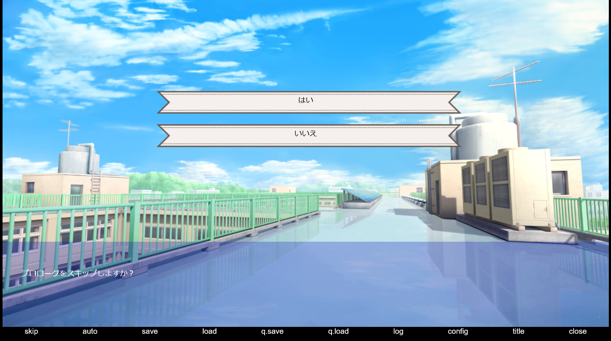

# testGame

## 動作確認手順

1. このレポジトリをクローン

   ```bash
   git clone https://github.com/EndoHizumi/testGame.git
   ```

2. 必要なモジュールをインストール

   ```bash
   npm install
   ```

3. ゲームを実行する

   ```bash
   npm run play
   ```

    localhost:8080 で、ブラウザが自動で起動します。
    別のブラウザを使いたいときは以下のコマンドを実行してください

   ```bash
   npm run dev
   ```

   以下の画面が表示されれば、起動成功です。
   
